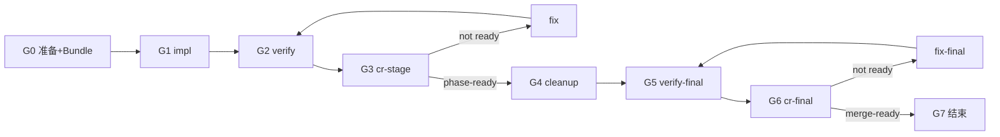

# Code Dev Loop

## 最小合规路径（门禁顺序）

未完成 **Gn** 不得输出「完成」类话术，不得结束 skill。



| 门禁 | 节点 | strict | compact |
|------|------|--------|---------|
| G1 | impl | 子代理 | 主代理可 inline（须声明） |
| G2 | verify | 子代理 | **子代理（必须）** |
| G3 | cr-stage | readonly 子代理 | readonly 子代理（**必须**） |
| G4–G5 | cleanup / verify-final | 子代理 | 子代理 |
| G6 | cr-final | readonly 子代理 | readonly 子代理（**必须**） |

---

## 目的

在 **spec 为唯一事实来源** 的前提下，分阶段实现并 **loop 至 closure**。

**为何默认派子代理**：主代理上下文有限；探索、实现、验证、独立 CR 由子代理执行并**摘要回报**，主代理保留编排与决策。

主代理与子代理的协作、说明、评审结论**一律使用中文**（路径、标识符等除外）。

---

## ⚠️ 上游探索 ≠ 可跳过 impl 子代理

**常见误判**（必须禁止）：

> 已在 `brain-storm` / `prd-generate` / `spec-generate` 中派探索子代理读过代码 → 主代理「已经了解项目」→ 直接 inline 写实现。

| 阶段 | 探索的目的 | 能否替代 impl 子代理 |
|------|------------|----------------------|
| brain-storm | 答疑、摸现状 | ❌ |
| prd-generate | 写 PRD 的业务现状 | ❌ |
| spec-generate | 写 spec 的技术现状 | ❌ |
| code-dev-loop explore | 本 iteration 改动前核对 | ❌ |

**规则**：

1. 上游探索报告 → 写入 **Context Bundle** 的「探索摘要」附件，**不是** impl 豁免券
2. 主代理为写 PRD/spec 读过代码 = **编排上下文**，不等于 **implementation 已闭环**
3. **strict（默认）**：无论上游是否探索，**G1 impl 须子代理**（强耦合链 = **单 impl 子代理**包整条链，不是主代理代写）
4. 仅 **compact**（见下，且 dynamic 声明）允许主代理 G1 inline；**G2 verify、G3/G6 CR 仍须子代理**

---

## 对用户合法结束语（仅三种）

| 结束语 | 条件 |
|--------|------|
| **merge-ready** | 全部门禁通过 + Closure Status 表 A/B 为空 |
| **blocked** | 需用户决策（spec 冲突、环境、产品拍板）；列出阻塞项 |
| **partial-delivery** | **仅当用户本轮明确接受**未闭合项；须列 A/B 类清单，**不得**称为 merge-ready |

**禁止**自造：「phase-1 ready」「核心已完成」「开发完成」「可以合并了」（未 cr-final 时）。

---

## 主代理 vs 子代理

| 主代理 | 子代理 |
|--------|--------|
| mode、phase、**Bundle-full / Bundle-delta** | G1 impl（strict）/ G2 verify / fix / cleanup |
| 派任务、同步等待、汇总 must-fix | G3/G6 **readonly code-review** |
| dynamic（含 `spec_deviations`） | inline 执行并中文回报 |

**硬规则**：G3 / G6 **永远** readonly 评审子代理；**fix 任何 P0/P1 后必须重跑 G3 或 G6**（见 inner loop）。

---

## 执行模式（mode）

| mode | G1 impl | G2 verify | G3/G6 CR | 选用条件 |
|------|---------|-----------|----------|----------|
| **strict**（默认） | 子代理 | 子代理 | 子代理 readonly | 正式交付 |
| **compact** | 主代理可 inline | **子代理必须** | **子代理 readonly 必须** | **同时**：单 phase + 单耦合链 + spec 已确认 + **变更文件清单已冻结** |
| **review-only** | 已完成 | — | cr-final 子代理 | 补救 |

**compact 不再用「≤5 文件」**——Mobile 8 文件耦合链仍可 compact，但须 **单 impl 执行体**（主代理 inline 或 **一个** impl 子代理）。

未在 dynamic 声明 mode 即主代理写代码 → **违规**。

**路由**：小步快跑 → **`agile-dev`**；execute-ready spec → **本 skill strict**。

---

## dynamic 必填字段（开始前）

```yaml
mode: strict | compact | review-only
spec_path: ...
spec_confirmed: yes | no   # no → 只读评审 spec 或 AskQuestion，不得 G1
spec_date: ...              # 与磁盘 spec Front Matter 一致
spec_deviations: []         # 每项：{ step, planned, actual, status: open|accepted|fixed }
last_cr_stage: pass|fail|none
last_cr_final: pass|fail|none
p0_open: 0
p1_open: 0
phase: ...
inner_round: ...
outer_round: ...
```

`spec_confirmed: no` 时不得进入 G1（用户从 spec-generate 直接说「开发吧」须先确认或只读对齐 spec）。

---

## 验收分层（merge-ready vs 合并后 QA）

| 类型 | 谁做 | 阻塞 merge-ready |
|------|------|------------------|
| 自动化测试 / build | agent（G2/G5） | ✅ 必须 |
| cr-stage / cr-final P0/P1 = 0 | readonly 评审子代理 | ✅ 必须 |
| spec `blocking: yes` 的步骤与测试 | agent | ✅ 必须 |
| 真机 / 录屏 / 主观 UX（spec `blocking: no` 或 `qa: manual_user`） | 用户 | ❌ **不阻塞**；merge-ready 后写入 PR「请你验收」 |

**不得**把 Android 录屏（C 类）与缺测试/cleanup（A/B 类）混在同一 follow-up 列表。

---

## 关键术语

### 交付状态（禁止混用）

| 状态 | 能否对用户说「完成」 |
|------|----------------------|
| impl-done | ❌ |
| phase-ready | ❌ 不得结束 skill |
| pipeline-ready | ❌ 仍须 G6 |
| **merge-ready** | ✅ 唯一正常终点 |
| post-merge-qa | 仅 merge-ready **之后**说明 |

### inner / outer loop

```text
G1 → G2 → G3 ─not ready─→ fix → G2 → G3（P0/P1 fix 后 G3 必重跑）
G4 → G5 → G6 ─not ready─→ fix-final → G5 → G6
```

- inner 每 phase 最多 **5** 轮；outer 最多 **3** 轮

### Context Bundle

**Bundle-full**（G1、首次 explore、phase 切换）：

```text
【Context Bundle — full】
- spec_path / spec_confirmed / branch
- Spec 摘要（≤15 行）
- 上游探索摘要（brain-storm / prd / spec 报告路径或要点，≤10 行）
- 已拍板决策（≤7 条）
- phase、节点 id、文件清单、接口契约、不变量
- spec_deviations 状态
- HEAD_SHA
```

**Bundle-delta**（fix 轮、重跑 cr 前）：

```text
【Context Bundle — delta】
- 节点 id、phase、HEAD_SHA
- 上轮 cr 结论（pass/fail）、last_cr_stage / last_cr_final
- 本轮 must-fix（P0/P1 列表）
- 本 fix 涉及文件
- p0_open / p1_open
```

fix 轮 **用 delta** 即可，避免重复粘贴 full；G1 新 phase 用 full。

---

## 开始前检查

- [ ] 工作区干净；非 main/master
- [ ] `spec_confirmed: yes`（或本轮用户明示确认 spec）
- [ ] `apm read` + `apm kb search`
- [ ] mode 写入 dynamic；建 **Bundle-full**
- [ ] 从 spec 读取各 Step 的 `phase` / `blocking`（见 spec-generate 模板）

---

## Step 1：拆 phase（读 spec Step 标注）

spec 每步应含：`Step N — phase-<id> — blocking: yes|no — qa: auto|manual_user`

| blocking | merge-ready |
|----------|-------------|
| **yes** | 该 step 实现 + 测试闭合，且无未确认 deviation |
| **no** | 可不实现；若 spec 标 `manual_user`，归 C 类 |

**单 phase spec 合法**；Step 3 promote、Step 4 测试若 `blocking: yes`，仍是 **同一 phase 内 B 类闭合项**，不得以「核心已做」甩到 follow-up。

**耦合编排**：

- 单耦合链 → **一个** G1 执行体（1 个 impl 子代理 **或** compact 主代理）
- 无文件冲突的多模块 → 多 impl 子代理可并行
- 同文件 → 串行

---

## Step 2：阶段内循环

### G1 impl

- **strict**：子代理 + Bundle-full
- **compact**：主代理 inline 前 dynamic 记 compact 理由；**仍须** Bundle-full

### G2 verify（phase）

**本 iteration 最小集**：

- `testPathPattern` / 受影响 workspace 测试
- 相关 package build（若 monorepo pretest 已 build core，在回报中 **声明**，供 G5 判断是否重复）

### G3 cr-stage

- readonly 子代理 + **code-review** `stage`
- 更新 dynamic：`last_cr_stage`、`p0_open`、`p1_open`
- **fix 闭合 P0/P1 后 → 必须重跑 G3**；`last_cr_stage: fail` 时 **禁止** G4

### phase-ready 条件

- G3 pass；P0=P1=0；blocking steps 闭合；`spec_deviations` 无 open

---

## Step 3：全局外循环

### G4 cleanup（子代理，不可跳过）

### G5 verify-final

| 与 G2 关系 | 做法 |
|------------|------|
| G2 已跑 **同命令** 全量 build + 全量相关测试 | 子代理回报「G5 已覆盖」，列命令与 G2 差异（可为空） |
| G2 仅窄测 | G5 跑 **repo 级清单**（写入 spec 或 Bundle：如 `npm run build -w @pkg/mobile`） |

### G6 cr-final

- readonly 子代理 + **code-review** `final`
- 更新 `last_cr_final`
- **fix-final 后必须重跑 G5 → G6**

---

## Spec 偏离（spec_deviations）

实现 ≠ spec 步骤时：

1. `spec_deviations` 追加 `{ step, planned, actual, status: open }`
2. **open 期间不得 phase-ready / merge-ready**
3. 闭合：**fixed**（补实现+测试）或 **accepted**（用户确认 + 更新 spec「已知偏差」）

---

## Closure 闸门

### Follow-up 三分法

| 类 | 处理 |
|----|------|
| **A** pipeline 未完成 | 继续 G4–G6，非 follow-up |
| **B** spec/测试/deviation | fix 或收窄 spec |
| **C** manual_user QA | 仅 merge-ready 后 |

### Closure Status 表（每次汇报必附）

```markdown
## Closure Status
| 检查项 | 状态 |
| 当前交付状态 | impl-done / … / merge-ready / paused-not-ready / blocked |
| spec_confirmed | yes/no |
| spec_deviations open | 0 / 列表 |
| G3 last_cr_stage | pass/fail/none；fix 后是否已重跑 |
| blocking steps + 测试 id | ✅/❌ |
| G4 cleanup | ✅/❌ |
| G5 verify-final | ✅/❌ |
| G6 cr-final | ✅/❌ |
| A/B 未完成 | 必须空才 merge-ready |
| C 合并后 QA | 仅 merge-ready 后填 |
```

### 暂停 / 部分交付

- **paused-not-ready**：列出 A/B 待续，不得称完成
- **partial-delivery**：仅用户明示接受；仍 **不得** 称 merge-ready

---

## 与上游 skill 衔接

| 上游 | 交给 code-dev-loop 的 |
|------|------------------------|
| spec-check-loop | execute-ready spec + Bundle 素材 |
| spec-generate | `spec_confirmed: yes`、探索报告路径、Step blocking 标注 |
| brain-storm | 探索摘要（**不**替代 G1 子代理） |

---

## 派遣约束

### 语言要求（执行类 prompt 必含）

```text
【语言要求】
- 全程使用中文；代码注释与公开 API 文档注释中文；commit message 中文
```

### fix 后重 CR（写入 fix prompt）

```text
本轮为 P0/P1 修复。完成后须重跑 verify，并等待新一轮 cr-stage/cr-final。
禁止在未重跑 CR 前宣称 ready。
```

---

## 失败处理

子代理失败：重试一次 → 仍失败则 `manual-review` 整理 must-fix，**strict 下不得长期主代理代 impl**。

---

## 执行检查清单

- [ ] dynamic 必填字段齐全；`spec_confirmed: yes`
- [ ] **未**因上游已探索而跳过 G1 子代理（compact 须声明）
- [ ] G2/G3/G4/G5/G6 子代理；G3/G6 readonly + code-review
- [ ] **P0/P1 fix 后已重跑 G3/G6**（查 `last_cr_stage/final`）
- [ ] `spec_deviations` 无 open
- [ ] blocking steps + 测试闭合
- [ ] 已附 Closure Status 表
- [ ] 结束语仅为 merge-ready / blocked / partial-delivery（用户接受）

---

## 备注

- 文档：`.apm/kb/docs/Iterations/<需求名称>/spec.md`
- 主对话上下文 >50% → **禁止** compact 继续 inline，改 strict
- 小 diff（如 <200 行）且单 phase：可 **省略 G3 仅做 G6** 仅当用户明示「跳过 stage CR」；**默认仍跑 G3**
